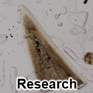
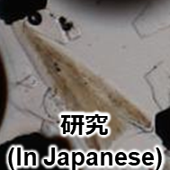

# Kazuhide Mimura / 見邨 和英

 
  

 
  
  

 
  

# Research / 研究

 
  
  

 

# Programing / プログラミング
## Competitive programming / 競技プログラミング
[AtCoder](https://atcoder.jp/users/mim_afol?lang=en) 

## Qualifications / 資格
[Deep Learning for GENERAL](https://www.jdla.org/en/en-certificate/) (2022#1)

(ディープラーニングG検定)

 
 
