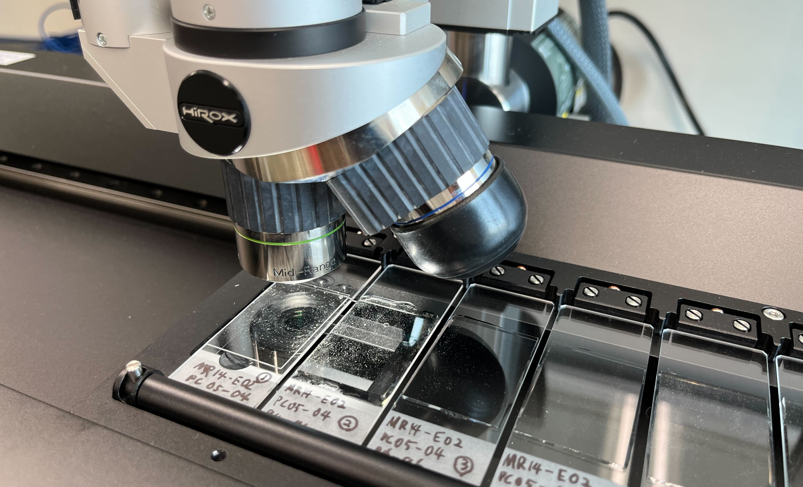

# 研究業績 / Kazuhide Mimura's  works

 
  

<a href="https://orcid.org/0000-0002-6411-0378">

https://orcid.org/0000-0002-6411-0378
</a>

 

# 目次 / Contents
- <a href="#査読付き論文--peer-reviewed-papers">査読付き論文 / Peer-reviewed Papers</a>
- <a href="#国際学会での発表--Presentations-at-International-Conferences">国際学会での発表 / Presentations at International Conferences</a>
- <a href="#国内学会での発表筆頭">国内学会での発表（筆頭）</a>
- <a href="#国内学会での発表共著">国内学会での発表（共著）</a>
- <a href="#受賞歴">受賞歴</a>

 

# 査読付き論文 / Peer-reviewed Papers

1. Cendi,  D. P. D., Agangi, A., Idrus, A., Chelle-Michou, C., Lai, C., Ishida, M., Guillong, M., Gonzáles-Álvarez, I., Takahashi, R., Yano, M., <u><b>Mimura, K.</b></u>, Ohta, J., Kato, Y., Simbolon, D. R., Xia, X.: The age and origin of the Ruwai polymetallic skarn deposit, Indonesia: evidence of Cretaceous mineralization in the Central Borneo metallogenic belt. Economic Geology (accepted).

2. <u><b>Mimura, K.</b></u>, Nakamura, K., Takao, K., Yasukawa, K. and Kato, Y.: Automated Detection of Hydrothermal Emission Signatures from Multi-Beam Echo Sounder Images Using Deep Learning. IEEE Journal of Selected Topics in Applied Earth Observations and Remote Sensing, 16, 2703-2710, https://doi.org/10.1109/JSTARS.2023.3247467, 2023.

3. Tanaka, E., <u><b>Mimura, K.</b></u>, Nakamura, K., Ohta, J., Yasukawa, K. and Kato, Y.: Rare-earth elements in deep-sea sediments in the South Pacific Gyre: Source materials and resource potentials. Geochemistry, Geophysics, Geosystems, 24, e2022GC010681. https://doi.org/10.1029/2022GC010681, 2023. 
  
4. <u><b>Mimura, K.</b></u> and Nakamura, K.: Datasets for training and validating a deep learning-based system to detect microfossil fish teeth from slide images. Data in Brief, 47, 108940. https://doi.org/10.1016/j.dib.2023.108940, 2023.
   
5. <u><b>Mimura, K.</b></u>, Minabe, S., Nakamura, K., Yasukawa, K., Ohta, J. and Kato, Y.: Automated detection of microfossil fish teeth from slide images using combined deep learning models. Applied Computing and Geosciences, 16, 100092, https://doi.org/10.1016/j.acags.2022.100092, 2022.
   
6. Yasukawa, K., Kino, S., Ohta, J., Azami, K., Tanaka, E., <u><b>Mimura, K.</b></u>, Fujinaga, K., Nakamura, K., Kato, Y.: Stratigraphic Variations of Fe–Mn Micronodules and Implications for the Formation of Extremely REY-Rich Mud in the Western North Pacific Ocean. Minerals, 11, 270, https://doi.org/10.3390/min11030270, 2021.

7. Yasukawa, K., Kino, S., Azami, K., Tanaka, E., <u><b>Mimura, K.</b></u>, Ohta, J., Fujinaga, K., Nakamura, K., Kato, Y.: Geochemical features of Fe-Mn micronodules in deep-sea sediments of the western North Pacific Ocean: Potential for co-product metal extraction from REY-rich mud. Ore Geology Reviews 127, 103805, https://doi.org/10.1016/j.oregeorev.2020.103805, 2020.

8.  Tanaka, E., Nakamura, K., Yasukawa, K., <u><b>Mimura, K.</b></u>, Fujinaga, K., Ohta, J., Iijima, K., Nozaki, T., Machida, S., Kato, Y.: Chemostratigraphic correlations of deep-sea sediments in the western North Pacific Ocean: A new constraint on the distribution of mud highly enriched in rare-earth elements. Minerals 10, 575, https://doi.org/10.3390/min10060575, 2020.

9.  Ohta, J., Yasukawa, K., Nozaki, T., Takaya, Y., <u><b>Mimura, K.</b></u>, Fujinaga, K., Nakamura, K., Usui, Y., Kimura, J.-I., Chang, Q., Kato, Y.: Fish proliferation and rare-earth deposition by topographically induced upwelling at the late Eocene cooling event. Scientific Reports 10, 9896, https://doi.org/10.1038/s41598-020-66835-8, 2020.

10. Tanaka, E., Nakamura, K., Yasukawa, K., <u><b>Mimura, K.</b></u>, Fujinaga, K., Iijima, K., Nozaki, T., Kato, Y.: Chemostratigraphy of deep-sea sediments in the western North Pacific Ocean: Implications for genesis of mud highly enriched in rare-earth elements and yttrium. Ore Geology Reviews 119, 103392, https://doi.org/10.1016/j.oregeorev.2020.103392, 2020.

11. <u><b>Mimura, K.</b></u>, Nakamura, K., Yasukawa, K., Machida, S., Ohta, J., Fujinaga, K., Kato, Y.: Significant impacts of pelagic clay on average chemical composition of subducting sediments: New insights from discovery of extremely rare-earth elements and yttrium-rich mud at Ocean Drilling Program Site 1149 in the western North Pacific Ocean. Journal of Asian Earth Sciences 186, 104059, https://doi.org/10.1016/j.jseaes.2019.104059, 2019.

12. Yasukawa, K., Ohta, J., <u><b>Mimura, K.</b></u>, Tanaka, E., Takaya, Y., Usui, Y., Fujinaga, K., Machida, S., Nozaki, T., Iijima, K., Nakamura, K. and Kato, Y.: A new and prospective resource for scandium: Evidence from the geochemistry of deep-sea sediment in the western North Pacific Ocean. Ore Geology Reviews 102, 260-267, https://doi.org/10.1016/j.oregeorev.2018.09.001, 2018.

 

# 国際学会での発表 / Presentations at International Conferences

1. Kuwahara, Y., Yasukawa, K., Ohta, J., Yano, M., <u><b>Mimura, K.</b></u>, Tanaka E., Fujinaga, K., Nakamura, K., Kato, Y.: The Paleogene Seawater Os Isotope Record of the Indian Ocean: Implications for the chemical weathering feedback against Eocene Hyperthermal Events. 12th In­ter­na­tional Con­fer­ence on Cli­matic and Bi­otic Events of the Pa­leo­gene (CBEP12) (Bremen, Germany, Poster,  Aug. 25, 2022)
   
2. Yasukawa, K., Kino, S., Ohta, J., Azami, K, Tanaka, E., <u><b>Mimura, K.</b></u>, Fujinaga, K., Nakamura, K. and Kato, Y.: Geochemistry and morphology of Fe-Mn micro nodules in REY-rich mud: Implications for the formation process of highly promising deep-sea REY resource. 3rd Edition of World Congress on Geology & Earth Science (Barcelona, Spain, Sep. 22, 2022) [Invited]  

3. Yasukawa, K., Kino, S., Ohta, J., Azami, K., Tanaka, E., <u><b>Mimura, K.</b></u>, Fujinaga, K., Nakamura, K. and Kato, Y.: Stratigraphic variations in geochemistry and morphology of Fe–Mn micronodules: Implications for the formation process of extremely REY-rich mud in the western North Pacific Ocean. Goldschmidt Virtual 2021 (Online, July 2021)

4. Ohta, J., Yasukawa, K., Nozaki, T., Takaya, Y., <u><b>Mimura, K.</b></u>, Fujinaga, K., Nakamura, K., Usui, Y., Kimura, J.-I., Chang, Q., Kato, Y. Fish debris and rare-earth deposition event in the latest Eocene revealed by osmium isotope stratigraphy. Goldschmidt 2020. June 23, 2020. (Online) 

5. <u><b>Mimura, K.</b></u>, Yamamoto K., Nakamura K., Yasukawa, K., Ohta J., Fujinaga K., Machida S., Usui Y. and Kato Y. Origin of REY-rich mud in the North Pacific Ocean constrained from bulk geochemistry and depositional age. Goldschmidt 2019. August 22, 2019, Barcelona, Spain. (Poster)

6. Kato Y., Yasukawa, K., Nakamura K., Fujinaga K., Takaya Y., Ohta J., Tanaka E., <u><b>Mimura, K.</b></u>, Iijima K., Machida S. and Nozaki T. REY-rich mud: An overview from scientific and engineering perspectives. Goldschmidt 2019. August 22, 2019, Barcelona, Spain. (Oral)

7. <u><b>Mimura, K.</b></u>, Yamamoto, K., Nakamura, K., Yasukawa, K., Ohta, J., Fujinaga, K., Machida, S. and Kato, Y. Chemostratigraphy and depositional ages of pelagic clay in the North Pacific Ocean: Implications for the origin of REY-rich mud. Goldschmidt 2018, August 16, 2018, Boston, USA. (Poster)

8. Yasukawa, K., Kawarabata, C., Tanaka, E., <u><b>Mimura, K.</b></u>, Nakamura, K., Fujinaga, K. and Kato, Y. A quantitative constraint on the distribution of extremely REY-rich mud based on mass balance calculations of Nd in the ocean. Goldschmidt 2018, August 17, 2018, Boston, USA. (Oral)

9.  <u><b>Mimura, K.</b></u>, Yamamoto, K., Nakamura, K., Yasukawa, K., Ohta, J., Fujinaga, K., Machida, S. and Kato, Y. A chemostratigraphic correlation of pelagic clay in the North Pacific Ocean. Goldschmidt 2017, August 16, 2017 Paris, France. (Poster)

10. <u><b>Mimura, K.</b></u>, Nakamura, K., Yasukawa, K., Ohta, J., Fujinaga, K., Machida, S. and Kato, Y. Chemostratigraphic correlation of deep-sea sediments in the western North Pacific Ocean and its implication for the origin of the extremely REY-rich mud. Goldschmidt 2016, June 29, 2016 Yokohama, Japan. (Oral)

 

# 国内学会での発表（筆頭）

1. <u><b>見邨和英</b></u>、中村謙太郎、安川和孝、Elizabeth Sibert、大田隼一郎、加藤泰浩：物体検出技術の微化石研究への適用可能性：YOLO-v7を使用した魚類の歯・鱗の微化石の自動検出モデルの構築からの示唆．JpGU meeting 2023 (Poster, 申請受理)
   
2. <u><b>見邨和英</b></u>、中村謙太郎、安川和孝、町田嗣樹、大田隼一郎、藤永公一郎、加藤泰浩：太平洋の遠洋性粘土に見られる地球化学的バリエーションとそのグローバル物質循環における重要性．日本地球化学会第69回年会 (高知，ハイブリッド開催，2022年9月) [Keynote]

3. <u><b>見邨和英</b></u>、中村謙太郎、高尾和宏、安川和孝、加藤泰浩：深層学習を用いたMulti-Beam Echo Sounder (MBES) 画像からの海底熱水活動シグナルの自動検出．JpGU Meeting 2022 (千葉，ハイブリッド開催，2022年5月)

4. <u><b>見邨和英</b></u>，三鍋秀悟，中村謙太郎，大田隼一郎，安川和孝，藤永公一郎，高尾和宏，加藤泰浩:　深層学習によるイクチオリス微化石自動検出技術の検討：レアアース泥の堆積年代制約に向けて．日本地質学会第128年学術大会　(Web開催，2021年9月)

5. <u><b>見邨和英</b></u>，中村謙太郎，安川和孝，大田隼一郎，藤永公一郎，臼井洋一，加藤泰浩: イクチオリス生層序と堆積物の全岩コバルト濃度を制約としたモンテカルロ法に基づく遠洋性粘土の堆積年代決定．JpGU Meeting 2021  (Web開催，2021年6月)

6. <u><b>見邨和英</b></u>・三鍋秀悟・大田隼一郎・中村謙太郎・安川和孝・藤永公一郎・高尾和宏・加藤泰浩．遠洋性粘土の年代決定に向けた魚類の歯化石 (イクチオリス) の効率的な収集・観察方法の開発．JpGU-AGU Joint Meeting 2020, SCG66-P14, July 2020. (Online)

7. <u><b>見邨和英</b></u>・三鍋秀悟・中村謙太郎・ 大田隼一郎・安川和孝・藤永公一郎・町田嗣樹・加藤泰浩：レアアース泥の年代決定に向けたイクチオリス層序の検討．日本地質学会第126年学術大会，R25-O-9, September 2019, Yamaguchi, Japan. (Oral)

8. <u><b>見邨和英</b></u>・山本克志・中村謙太郎・安川和孝・大田隼一郎・藤永公一郎・町田嗣樹・臼井洋一・加藤泰浩：DSDP/ODPの遠洋性粘土コアに記録された北太平洋における新生代の環境変動．日本地球惑星科学連合2019年大会，MIS15-01, May 2019, Chiba, Japan. (Oral)

9.  <u><b>見邨和英</b></u>・中村謙太郎・安川和孝・大田隼一郎・藤永公一郎・町田嗣樹・加藤泰浩：伊豆・小笠原海溝に沈み込む海底堆積物の平均化学組成に対するレアアース泥の影響の定量的評価．日本地質学会第125年学術大会，R25-O-9, December 2018, Tsukuba, Japan (Oral)

10. <u><b>見邨和英</b></u>・山本克志・中村謙太郎・安川和孝・大田隼一郎・藤永公一郎・町田嗣樹・加藤泰浩：Origin of common chemostratigraphy of pelagic clay in the North Pacific Ocean: age constraints from ichthyolith stratigraphy. 日本地球惑星科学連合2018年大会, SCG61-06, May 2018, Chiba, Japan. (Oral, 学生優秀発表賞受賞)

11. <u><b>見邨和英</b></u>・山本克志・中村謙太郎・安川和孝・大田隼一郎・藤永公一郎・町田嗣樹・加藤泰浩：全岩化学組成に基づく北太平洋の遠洋性深海堆積物層序．JpGU-AGU Joint Meeting 2017，BPT05-22. May 2017, Chiba, Japan. (Oral)

12. <u><b>見邨和英</b></u>・中村謙太郎・安川和孝・大田隼一郎・藤永公一郎・町田嗣樹・加藤泰浩：全岩化学組成に基づく北西太平洋の深海堆積物層序：レアアース泥起源への示唆．日本地球惑星科学連合2016年大会，BPT05-P17. May 2016, Chiba, Japan. (Poster)

 

# 国内学会での発表（共著）

1. 青柳颯汰、大田隼一郎、矢野萌生、<u><b>見邨和英</b></u>、浅見慶志朗、野崎達生、中村謙太郎、安川和孝、町田嗣樹、加藤泰浩：南鳥島マンガンノジュールのOs同位体層序年代決定とμXRF元素マッピングによる成長ハイエイタスの実態解明．日本地質学会第129年学術大会 (東京，2022年9月)

2. 北澤尭大、<u><b>見邨和英</b></u>、安川和孝、大田隼一郎、藤永公一郎、中村謙太郎、加藤泰浩：深層学習に基づく画像検出システムを用いた南鳥島レアアース泥のイクチオリス層序年代決定．日本地質学会第129年学術大会 (東京，2022年9月)

3. 桑原佑典、安川和孝、大田隼一郎、矢野萌生、<u><b>見邨和英</b></u>、田中えりか、藤永公一郎、中村謙太郎、加藤泰浩：インド洋の炭酸塩堆積物より復元した古第三紀の海水Os同位体比記録：始新世「超温暖化」イベントにおける化学風化フィードバックへの示唆．JpGU Meeting 2022  (千葉，ハイブリッド開催，2022年5月) [Invited]

4. 北澤尭大、<u><b>見邨和英</b></u>、安川和孝、大田隼一郎、藤永公一郎、中村謙太郎、加藤泰浩：深層学習に基づくイクチオリス画像検出システムを用いた南鳥島レアアース泥の堆積年代決定．JpGU Meeting 2022   (千葉，ハイブリッド開催，2022年5月).

5. 安川和孝，木野聡志，浅見慶志朗，田中えりか，<u><b>見邨和英</b></u>，大田隼一郎，藤永公一郎，中村謙太郎，加藤泰浩: 南鳥島レアアース泥に含まれるマイクロマンガンノジュールの地球化学的特徴とレアメタル資源ポテンシャル．日本地質学会第128年学術大会 (Web開催，2021年9月)

6. 安川和孝，平松彩人，河原畑智朱，<u><b>見邨和英</b></u>，田中えりか，大田隼一郎，藤永公一郎，中村謙太郎，加藤泰浩: 海洋の Nd 質量収支計算を用いた超高濃度レアアース泥の生成条件の制約．第37回希土類討論会 (Web開催，2021年6月)

7. 大田隼一郎・安川和孝・野崎達生・高谷雄太郎・<u><b>見邨和英</b></u>・藤永公一郎・中村謙太郎・臼井洋一・木村純一・常青・加藤泰浩：Fish debris and rare-earth deposition caused by topographically induced upwelling in the latest Eocene. JpGU-AGU Joint Meeting 2020, BCG06-02, July 2020. (Online)

8. 加藤泰浩・安川和孝・中村謙太郎・ 藤永公一郎・大田隼一郎・町田嗣樹・高谷雄太郎・田中えりか・<u><b>見邨和英</b></u>・野崎達生・飯島耕一：レアアース泥に関する最新研究成果．日本地質学会第126年学術大会，R25-O-7, September 2019, Yamaguchi, Japan. (Oral)

9. 藤永公一郎・安川和孝・野崎達生・町田嗣樹・高谷雄太郎・大田隼一郎・矢野萌生・下村遼・田中えりか・<u><b>見邨和英</b></u>・堀之内航一・松本賢治・臼井洋一・山本浩文・中村謙太郎・加藤泰浩・KM17-14C航海 乗船者一同：南鳥島EEZの拓洋第5海山東方海域におけるレアアース泥の地球化学的特徴と分布状況．日本地球惑星科学連合2019年大会，SCG56-09, May 2019, Chiba, Japan. (Oral)

10. 加藤泰浩・中村謙太郎・藤永公一郎・安川和孝・高谷雄太郎・大田隼一郎・田中えりか・<u><b>見邨和英</b></u>・飯島耕一・町田嗣樹・野崎達生・木村純一・岩森光：レアアース泥に関する最新研究成果の概観．日本地球惑星科学連合2019年大会，BCG07-05, May 2019, Chiba, Japan. (Oral)

11. 三鍋秀悟・<u><b>見邨和英</b></u>・中村謙太郎・大田隼一郎・安川和孝・藤永公一郎・町田嗣樹・加藤泰浩：イクチオリス層序に基づく南太平洋レアアース泥の堆積年代および堆積場の制約．日本地球惑星科学連合2019年大会，MIS15-P01, May 2019, Chiba, Japan. (Poster)

12. 加藤泰浩・安川和孝・中村謙太郎・藤永公一郎・高谷雄太郎・大田隼一郎・町田嗣樹・田中えりか・<u><b>見邨和英</b></u>・飯島耕一・野崎達生・木村純一・岩森光：南鳥島周辺EEZにおけるレアアース泥研究の最前線．第35回希土類討論会，2B-8, May 2019, Osaka, Japan. (Oral)

13. 田中えりか・安川和孝・中村謙太郎・<u><b>見邨和英</b></u>・藤永公一郎・飯島耕一・野崎達生・加藤泰浩：南鳥島レアアース泥の化学層序：レアアース濃集機構に対する示唆．第35回希土類討論会，2B-7, May 2019, Osaka, Japan. (Oral)

14. 安川和孝・大田隼一郎・<u><b>見邨和英</b></u>・田中えりか・高谷雄太郎・臼井洋一・藤永公一郎・町田嗣樹・野崎達生・飯島耕一・中村謙太郎・加藤泰浩：新規スカンジウム資源としての南鳥島レアアース泥のポテンシャル．第35回希土類討論会，2B-6, May 2019, Osaka, Japan. (Oral)

15. 藤永公一郎・安川和孝・町田嗣樹・佐藤峰南・下村遼・田中えりか・<u><b>見邨和英</b></u>・臼井洋一・飯島耕一・高橋亜夕・山本浩文・鈴木勝彦・中村謙太郎・加藤泰浩・MR16-07乗船者一同：南鳥島南東方海域におけるレアアース泥の地球化学．日本地球惑星科学連合2018年大会, SCG61-04, May 2018, Chiba, Japan. (Oral)

16. 山本克志・<u><b>見邨和英</b></u>・中村謙太郎・安川和孝・大田隼一郎・藤永公一郎・町田嗣樹・加藤泰浩：北西太平洋深海堆積物コアの全岩化学組成に基づく深海堆積物共通層序の解明．日本地球惑星科学連合2018年大会, SCG61-P14, May 2018, Chiba, Japan. (Poster)

17. 藤永公一郎・中村謙太郎・高谷雄太郎・安川和孝・<u><b>見邨和英</b></u>・王子艦・加藤泰浩：日本列島付加体中のレアアース泥由来の構成岩の再検討．日本地質学会第124年学術大会，R25-O-10，September 2017, Matsuyama, Japan. (Oral)

18. 山本克志・<u><b>見邨和英</b></u>・中村謙太郎・安川和孝・大田隼一郎・藤永公一郎・町田嗣樹・加藤泰浩：北西太平洋深海堆積物の全岩化学組成に基づくレアアース泥の起源の解明．日本地質学会第124年学術大会，R25-O-8，September 2017, Matsuyama, Japan. (Oral)

19. 加藤泰浩・中村謙太郎・藤永公一郎・安川和孝・高谷雄太郎・大田隼一郎・田中えりか・<u><b>見邨和英</b></u>・飯島耕一・町田嗣樹・野崎達生・木村純一・岩森光：レアアース泥研究の最新成果と南鳥島EEZにおける開発の実現に向けた取り組み．日本地質学会第124年学術大会，R25-O-6，September 2017, Matsuyama, Japan. (Oral)

20. 山本克志・<u><b>見邨和英</b></u>・中村謙太郎・安川和孝・大田隼一郎・藤永公一郎・町田嗣樹・加藤泰浩：北西太平洋深海堆積物コアの全岩化学組成に基づくレアアース泥起源の解明．JpGU-AGU Joint Meeting 2017，BPT05-P17. May 2017, Chiba, Japan. (Poster)

21. 中村謙太郎・李斯暘・安川和孝・<u><b>見邨和英</b></u>・藤永公一郎・大田隼一郎・町田嗣樹・加藤泰浩：南太平洋におけるレアアース泥の分布と成因の解明．JpGU-AGU Joint Meeting 2017，BPT05-23. May 2017, Chiba, Japan. (Oral)

22. 加藤泰浩・中村謙太郎・藤永公一郎・安川和孝・高谷雄太郎・大田隼一郎・田中えりか・<u><b>見邨和英</b></u>・飯島耕一・町田嗣樹・野崎達生・木村純一・岩森光：The latest research on REY-rich mud in the Pacific Ocean. JpGU-AGU Joint Meeting 2017, BPT05-19. May 2017, Chiba, Japan. (Oral)

23. 中村謙太郎・<u><b>見邨和英</b></u>・安川和孝・藤永公一郎・加藤泰浩：南鳥島EEZにおけるレアアース泥を含む深海堆積物の化学層序．日本地質学会第123年学術大会，R24-O-3, September 2016, Tokyo, Japan. (Oral)

 

# 受賞歴

1. 東京大学大学院工学研究科　システム創成学専攻優秀博士学生賞 (2021年)

2. 日本地球惑星科学連合2018年大会　[学生優秀発表賞](https://www.jpgu.org/news/2018/2586/)

