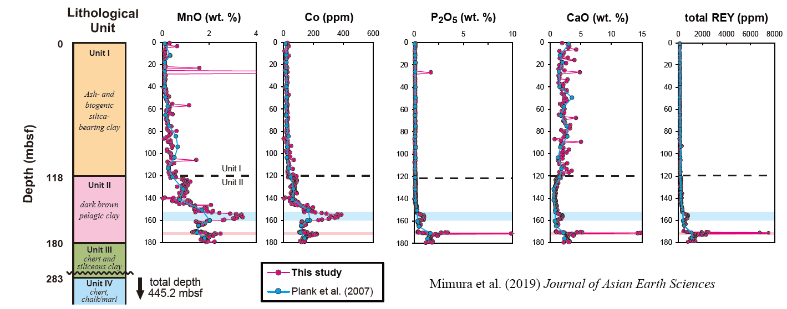

# Research

 
  

## Positions
- [Ocean Resources Research Center for Next Generation, Chiba Institute of Technology](https://www.it-chiba.ac.jp/orceng/) Chief Research Scientist
- [Frontier Research Center for Energy and Resources, School of Engineering](http://www.frcer.t.u-tokyo.ac.jp/) Visiting researcher

## Research Topics
### Elucidating genesis of deep-sea mud enriched in rare-earth elements ("REY-rich mud")

 
  

Reference: Mimura et al. (2019) 
<a href="https://doi.org/10.1016/j.jseaes.2019.104059"><i>Journal of Asian Earth Sciences</i></a>

 

Rare earth elements are indispensable for cutting-edge industries such as wind power generation and electric vehicles. However, the global supply of rare earths is dominated by a few countries, which sometimes causes serious problems in these industries.
Under such a situation, deep-sea mud containing high concentration of rare-earth elements and yttrium, termed as "REY-rich mud", is attracting attention as a new seafloor mineral resource.
In order to constrain "promising areas", where intensive exploration should be conducted, from broad ocean floor, it is important to clarify environmental conditions that cause enrichment of rare-earths in deep-sea sediment. 

 
 

### Constraining depositional age of pelagic clay using microfossil fish teeth

 
  

Reference: Mimura et al. (2018) 
<a href="https://goldschmidt.info/2018/abstracts/abstractView?id=2018002446"><i>Goldschmidt 2018</i></a>

Constraining depositional age is very important in constraining the environmental conditions of the sediment.
However, pelagic clay, where REY-rich mud is sedimentorogically categorized, does not include fossils such as radiolarians and foraminifera, which are commonly used to determine the age of seafloor sediments. Therefore, dating pelagic clay is known to be very difficult.
To solve this problem, I am trying to reconstruct biostratigraphy of "ichthyoliths", microfossils of fish teeth and denticles.

 
 

### Automated detection of microfossils of fish teeth using deep-learning

 
  

Reference: 
<a href="https://github.com/KazuhideMimura/yolov5-ichthyolith">GitHub</a>

For a long time (since the 1970s for ichthyoliths), the observation of microfossils required enormous amount of time and manual effort (1) to find the target fossil from various particles and (2) to identify the name of species based on its shape and internal structure.

To reduce these obstacles, we are conducting research on the automated detectioin of fossils from microscopic images using a deep-learning based method called "object detection.

 
 

## Works

<a href="https://orcid.org/0000-0002-6411-0378">

https://orcid.org/0000-0002-6411-0378
</a>

peer-reviewed papers

1. Yasukawa, K., Kino, S., Ohta, J., Azami, K., Tanaka, E., <u><b>Mimura, K.</b></u>, Fujinaga, K., Nakamura, K., Kato, Y.　Stratigraphic Variations of Fe–Mn Micronodules and Implications for the Formation of Extremely REY-Rich Mud in the Western North Pacific Ocean. Minerals, 11, 270, 2021.

1. Yasukawa, K., Kino, S., Azami, K., Tanaka, E., <u><b>Mimura, K.</b></u>, Ohta, J., Fujinaga, K., Nakamura, K., Kato, Y. Geochemical features of Fe-Mn micronodules in deep-sea sediments of the western North Pacific Ocean: Potential for co-product metal extraction from REY-rich mud. Ore Geology Reviews 127, 103805, 2020.

1. Tanaka, E., Nakamura, K., Yasukawa, K., <u><b>Mimura, K.</b></u>, Fujinaga, K., Ohta, J., Iijima, K., Nozaki, T., Machida, S., Kato, Y. Chemostratigraphic correlations of deep-sea sediments in the western North Pacific Ocean: A new constraint on the distribution of mud highly enriched in rare-earth elements. Minerals 10, 575, 2020.

1. Ohta, J., Yasukawa, K., Nozaki, T., Takaya, Y., <u><b>Mimura, K.</b></u>, Fujinaga, K., Nakamura, K., Usui, Y., Kimura, J.-I., Chang, Q., Kato, Y. Fish proliferation and rare-earth deposition by topographically induced upwelling at the late Eocene cooling event. Scientific Reports 10, 9896, 2020.

1. Tanaka, E., Nakamura, K., Yasukawa, K., <u><b>Mimura, K.</b></u>, Fujinaga, K., Iijima, K., Nozaki, T., Kato, Y. Chemostratigraphy of deep-sea sediments in the western North Pacific Ocean: Implications for genesis of mud highly enriched in rare-earth elements and yttrium. Ore Geology Reviews 119, 103392, 2020.

1. <u><b>Mimura, K.</b></u>, Nakamura, K., Yasukawa, K., Machida, S., Ohta, J., Fujinaga, K., Kato, Y. Significant impacts of pelagic clay on average chemical composition of subducting sediments: New insights from discovery of extremely rare-earth elements and yttrium-rich mud at Ocean Drilling Program Site 1149 in the western North Pacific Ocean. Journal of Asian Earth Sciences 186, 104059, 2019.

1. Yasukawa, K., Ohta, J., <u><b>Mimura, K.</b></u>, Tanaka, E., Takaya, Y., Usui, Y., Fujinaga, K., Machida, S., Nozaki, T., Iijima, K., Nakamura, K. and Kato, Y. A new and prospective resource for scandium: Evidence from the geochemistry of deep-sea sediment in the western North Pacific Ocean. Ore Geology Reviews 102, 260-267, 2018.

Presentations at International Conferences

1. Yasukawa, K., Kino, S., Ohta, J., Azami, K., Tanaka, E., <u><b>Mimura, K.</b></u>, Fujinaga, K., Nakamura, K. and Kato, Y.: Stratigraphic variations in geochemistry and morphology of Fe–Mn micronodules: Implications for the formation process of extremely REY-rich mud in the western North Pacific Ocean. Goldschmidt Virtual 2021 (Online, July 2021)

1. Ohta, J., Yasukawa, K., Nozaki, T., Takaya, Y., <u><b>Mimura, K.</b></u>, Fujinaga, K., Nakamura, K., Usui, Y., Kimura, J.-I., Chang, Q., Kato, Y. Fish debris and rare-earth deposition event in the latest Eocene revealed by osmium isotope stratigraphy. Goldschmidt 2020. June 23, 2020. (Online) 

1. <u><b>Mimura, K.</b></u>, Yamamoto K., Nakamura K., Yasukawa, K., Ohta J., Fujinaga K., Machida S., Usui Y. and Kato Y. Origin of REY-rich mud in the North Pacific Ocean constrained from bulk geochemistry and depositional age. Goldschmidt 2019. August 22, 2019, Barcelona, Spain. (Poster)

1. Kato Y., Yasukawa, K., Nakamura K., Fujinaga K., Takaya Y., Ohta J., Tanaka E., <u><b>Mimura, K.</b></u>, Iijima K., Machida S. and Nozaki T. REY-rich mud: An overview from scientific and engineering perspectives. Goldschmidt 2019. August 22, 2019, Barcelona, Spain. (Oral)

1. <u><b>Mimura, K.</b></u>, Yamamoto, K., Nakamura, K., Yasukawa, K., Ohta, J., Fujinaga, K., Machida, S. and Kato, Y. Chemostratigraphy and depositional ages of pelagic clay in the North Pacific Ocean: Implications for the origin of REY-rich mud. Goldschmidt 2018, August 16, 2018, Boston, USA. (Poster)

1. Yasukawa, K., Kawarabata, C., Tanaka, E., <u><b>Mimura, K.</b></u>, Nakamura, K., Fujinaga, K. and Kato, Y. A quantitative constraint on the distribution of extremely REY-rich mud based on mass balance calculations of Nd in the ocean. Goldschmidt 2018, August 17, 2018, Boston, USA. (Oral)

1. <u><b>Mimura, K.</b></u>, Yamamoto, K., Nakamura, K., Yasukawa, K., Ohta, J., Fujinaga, K., Machida, S. and Kato, Y. A chemostratigraphic correlation of pelagic clay in the North Pacific Ocean. Goldschmidt 2017, August 16, 2017 Paris, France. (Poster)

1. <u><b>Mimura, K.</b></u>, Nakamura, K., Yasukawa, K., Ohta, J., Fujinaga, K., Machida, S. and Kato, Y. Chemostratigraphic correlation of deep-sea sediments in the western North Pacific Ocean and its implication for the origin of the extremely REY-rich mud. Goldschmidt 2016, June 29, 2016 Yokohama, Japan. (Oral)

 
 

## skills
### biostratigraphy
- ichthyolith biostratigraphy

### Chamical analysis
- Bulk chemical analysis
- Re-Os isotope analysis

### Data analyses
- principal component analysis
- independent component analysis
- cluster analysis

### Programing
- Python
(main) 

Other programing languages I have used
- R
- Excel VBA
- gnuplot
